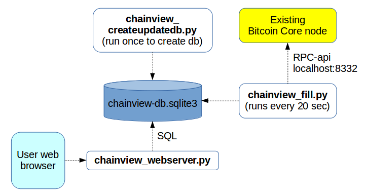

# chainview
Block explorer for Bitcoin Edu

- Simple implementation relying on the Bitcoin Core node for information
- Handles 1xxx, 3xxx and bc1-addresses
- Written in Python 3 using an sqlite3 database and the Flask web framework
- Reads blockchain information using only RPC-api of Bitcoin Core node
- Separate processes to fill database and to serve web pages
- Currently server-side only, no javascript

## Overview

## Installation
Using normal linux package management:
- Install python 3 (debian package: python3)
- Install pip for python 3 (debian package: python3-pip)

Using pip (or maybe distribution packages as above):
- pip3 install requests
- pip3 install sqlite3
- pip3 install flask
- pip3 install gunicorn

Run:
- Make sure you have a Bitcoin Core node running (bitcoind or bitcoin-qt)
- Enable RPC and txindex in bitcoin.conf (server=1, rpcuser=xxx, rpcpassword=yyy, txindex=1)
- Modify config in chainview_config.py
- Only once (first time): run chainview_createupdatedb.py
- Run: chainview_fill.py
- Run: chainview_run_gunicorn.sh (modify script to select web server port number)

The fill and gunicorn processes can easiest be run inside screen or tmux. Then, detatch and they will continue running.

## Implementation overview

The web server part consists of the following files:
- **chainview_webserver.py** - the main web server methods (using Flask)
- **static/main.css** - css used for all pages
- **template/** - templates for all html pages (Flask templates)

Templates:
- **main-page** - main block listing page
- **block-page** - one block view with transactions
- **stats-page** - statistics page
- **address-page** - address summary and transactions
- **layout** - base for all pages above (common page header)
- **transaction-list** - included by block-page and address-page to show transaction list

Currently, the html pages are quite simple (and old fashioned) - no javascript
is used on the client side, everything is generated by the python code.

